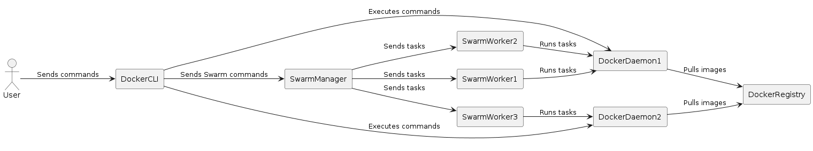

= Docker Swarm Cheat Sheet

:doctype: book
:icons: font
:experimental:
:imagesdir: images
:source-highlighter: coderay
:toc: left
:toclevels: 3
:sectnums:
:idprefix:
:idseparator: _
:doctype: book
:stem: latexmath
:backend: html5
:asciidoctor-diagram:

== What is Docker Swarm?

Docker Swarm is a native clustering and orchestration solution for Docker containers. It allows you to create and manage a cluster of Docker nodes (which can be either physical or virtual machines) and deploy  applications to the cluster as a single unit.

NOTE: Docker Swarm uses the same Docker API as the Docker Engine, which means that you can use the same commands and tools to manage both Docker containers and Docker Swarm clusters.

== Docker Swarm: An Introduction

Docker Swarm is a native clustering and orchestration solution for Docker containers. It allows you to create and manage a cluster of Docker nodes, which can be used to run and scale your containerized applications.

== Use Cases for Docker Swarm

Docker Swarm is used in a variety of scenarios, including:

- **High Availability**: Docker Swarm provides built-in high availability features, which allow your applications to continue running even if a node fails.
- **Scalability**: Docker Swarm makes it easy to scale your applications horizontally, by adding or removing nodes as needed.
- **Load Balancing**: Docker Swarm includes built-in load balancing capabilities, which can distribute traffic across multiple nodes in the cluster.
- **Security**: Docker Swarm includes security features, such as mutual TLS authentication, which help protect your applications from unauthorized access.

== How Docker Swarm Works

Docker Swarm consists of a group of Docker nodes, which are connected together to form a cluster. The cluster is managed by a swarm manager, which coordinates the deployment and scaling of your applications.

When you deploy an application to Docker Swarm, it is split into a number of tasks, each of which is run on a separate node in the cluster. The swarm manager ensures that the tasks are distributed evenly across the nodes, and that the desired number of replicas are running at all times.

To illustrate how Docker Swarm works, consider the following example:

== Basic Docker Swarm Commands

[source, bash]
----
# Initialize a new swarm
docker swarm init

# Join a swarm as a worker
docker swarm join --token TOKEN MASTER_IP:PORT

# Join a swarm as a manager
docker swarm join-token manager

# List nodes in the swarm
docker node ls

# Deploy a stack
docker stack deploy -c COMPOSE_FILE STACK_NAME

# List stacks
docker stack ls

# List services in a stack
docker stack services STACK_NAME

# Remove a stack
docker stack rm STACK_NAME
----

- *docker swarm init*: This command initializes a new swarm, which is a group of Docker nodes that work together to run your applications.
- *docker swarm join --token TOKEN MASTER_IP:PORT*: This command joins a node to an existing swarm as a worker. Replace `TOKEN` with the token provided by the `docker swarm init` command, and `MASTER_IP:PORT` with the IP address and port of the swarm manager.
- *docker swarm join-token manager*: This command generates a token for joining the swarm as a manager. Run this command on the manager node and copy the output to join a new manager node to the swarm.
- *docker node ls*: This command lists all the nodes in the swarm.
- *docker stack deploy -c COMPOSE_FILE STACK_NAME*: This command deploys a stack to the swarm. Replace `COMPOSE_FILE` with the path to your Docker Compose file and `STACK_NAME` with the name you want to give the stack.
- *docker stack ls*: This command lists all the stacks running in the swarm.
- *docker stack services STACK_NAME*: This command lists all the services in a stack.
- *docker stack rm STACK_NAME*: This command removes a stack from the swarm.

== Advanced Docker Swarm Commands

[source, bash]
----
# Scale a service
docker service scale SERVICE_NAME=REPLICAS

# Update a service
docker service update --image NEW_IMAGE SERVICE_NAME

# Drain a node
docker node update --availability drain NODE_NAME

# Promote a node to a manager
docker node promote NODE_NAME

# Demote a manager to a worker
docker node demote NODE_NAME

# Remove a node from the swarm
docker node rm NODE_NAME

# Create a secret
echo "SECRET_VALUE" | docker secret create SECRET_NAME -

# List secrets
docker secret ls

# Remove a secret
docker secret rm SECRET_NAME
----

- *docker service scale SERVICE_NAME=REPLICAS*: This command scales a service to the specified number of replicas. Replace `SERVICE_NAME` with the name of the service you want to scale and `REPLICAS` with the number of replicas you want to run.
- *docker service update --image NEW_IMAGE SERVICE_NAME*: This command updates the image used by a service. Replace `NEW_IMAGE` with the name of the new image and `SERVICE_NAME` with the name of the service you want to update.
- *docker node update --availability drain NODE_NAME*: This command marks a node as drained, which means that no new tasks will be scheduled on it. Replace `NODE_NAME` with the name of the node you want to drain.
- *docker node promote NODE_NAME*: This command promotes a worker node to a manager node. Replace `NODE_NAME` with the name of the node you want to promote.
- *docker node demote NODE_NAME*: This command demotes a manager node to a worker node. Replace `NODE_NAME` with the name of the node you want to demote.
- *docker node rm NODE_NAME*:

